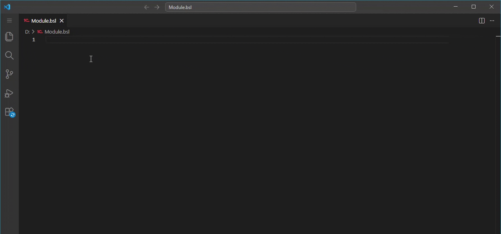

[On English](#format-string-wizard-for-bsl-1centerprise)

# Конструктор форматной строки для BSL (1С:Предприятие)

Это расширение для VSCode предоставляет QuickPick-интерфейс конструктора форматной строки на языке 1С.

## Возможности

- Запуск из контекстного меню или из палитры команд
- Навигация по параметрам
- Быстрая навигация клавишами (ALT+← - Назад; CTRL+Enter - Готово)
- Разбор текущей форматной строки
- Формирование форматной строки
- Поддержка как английских, так и русских ключей
- Валидация вводимых значений
- Возможность сбросить желаемую настройку
- Настройки локализации (Язык (Страна))
- Настройки числовых значений (Длина, Точность, Сдвиг, Разделитель дробной части, Разделитель групп, Группировка, Представление нуля, Представление отрицательных чисел, Выводить лидирующие нули, Шаблон форматирования числа)
- Настройки дат (Формат даты, Локальный формат даты, Представление пустой даты)
- Настройки булевых значений (Представление значения булево Ложь, Представление значения булево Истина)

## Использование

1. Откройте файл с расширением `*.bsl` или `*.os`, либо выберите подсветку языка BSL.
2. Поставьте курсор на имеющуюся форматную строку, либо в место, куда ее нужно вставить.
3. Вызовите команду из палитры команд (`CTRL+SHIFT+P` → Конструктор форматной строки BSL), либо нажав ПКМ и выбрав пункт "Конструктор форматной строки...".
4. Выберите нужную настройку. Для навигации используйте кнопку **Назад** (`ALT+←`) в заголовке и клавишу **Enter**.
5. Некоторые значения являются числами, некоторые строками, некоторые булевыми. Некоторые запрашивают выбор значения из списка, некоторые только подсказывают возможные варианты.
6. При необходимости можно навести курсор на настройку и нажать кнопку **Очистить**.
7. После ввода всех требуемых настроек нажмите кнопку **Готово** (`CTRL+Enter`) в заголовке.

# Format String Wizard for BSL (1C:Enterprise)

This VSCode extension provides a QuickPick-based format string wizard for the 1C:Enterprise language.

## Features

- Launch via context menu or command palette
- Parameter navigation
- Hotkey navigation support (ALT+← - Back; CTRL+Enter - Done)
- Parsing of existing format string
- Generation of format string
- Support for both English and Russian keys
- Input validation
- Ability to reset preferred setting
- Localization settings (Language (Country))
- Number formatting (Length, Precision, Shift, Decimal separator, Thousands separator, Grouping, Zero presentation, Negative numbers representation, Display leading zeros, Number format template)
- Date formatting (Date format, Local date format, Empty date presentation)
- Boolean formatting (Boolean value presentation False, Boolean value presentation True)

## Usage

1. Open a file with a `*.bsl` or `*.os` extension, or select BSL language syntax highlighting.
2. Place the cursor on an existing format string or where you want to insert a new one.
3. Run the command via the Command Palette (`CTRL+SHIFT+P` → BSL Format String Constructor) or right-click and select "Format String Constructor...".
4. Select the desired setting. Use the **Back** button (`ALT+←`) in the header and the **Enter** key to navigate.
5. Some settings require numbers, strings, or boolean value. Some offer a fixed list of options, while others provide suggestions.
6. Hover over the setting and click **Clear** button if required.
7. Once all settings are configured, click **Done** (`CTRL+Enter`) button in the header.